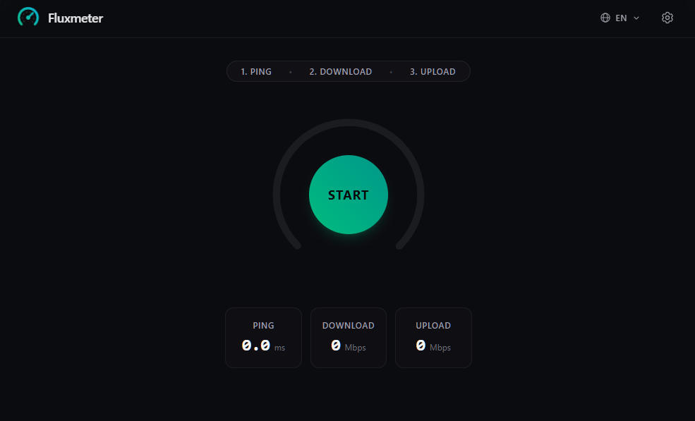

# Fluxmeter



[](https://crates.io/crates/fluxmeter) [](https://crates.io/crates/fluxmeter) [](./LICENSE) [](https://crates.io/crates/fluxmeter)

Fluxmeter is a lightweight, self-hosted speedtest server written in Rust. It embeds a modern web interface directly into a single, zero-dependency binary.

## Getting Started

### Pre-built Binaries

You can download a pre-built binary from the [Releases](https://github.com/DarkCeptor44/fluxmeter/releases) page.

### Building From Source

1. **Prerequisites:** Ensure you have the [Rust toolchain](https://rustup.rs/) and [Bun](https://bun.com/) installed.
2. Clone the repo:

    ```bash
    git clone https://github.com/DarkCeptor44/fluxmeter.git
    cd fluxmeter
    ```

3. Run or build the binary:

    ```bash
    # development
    cargo run

    # local installation
    cargo install --path .
    ```

## Usage

```console
$ fluxmeter
2026-09-22T10:49:07.4480111-03:00 [INFO]
===================================================
---------------- Fluxmeter v0.1.0 -----------------
===================================================

2026-09-22T10:49:07.4524887-03:00 [INFO]
    listening on http://0.0.0.0:7890
    listening on http://localhost:7890
```

```console
$ fluxmeter -h
A lightweight speedtest server

Usage: fluxmeter [OPTIONS]

Options:
  -H, --host <HOST>  Host to listen on [env: FM_HOST=] [default: 0.0.0.0]
  -p, --port <PORT>  Port to listen on [env: FM_PORT=] [default: 7890]
      --debug        Enable debug logging [env: FM_DEBUG=]
  -h, --help         Print help
  -V, --version      Print version
```

## MSRV

The minimum supported Rust version is:

| Version | Edition | MSRV |
| --- | --- | --- |
| `<= 0.1.0` | 2024 | 1.88.0 |

## Environment Variables

The following environment variables are currently supported, they are used if the CLI flags are not set:

| Variable | Default | Description |
| --- | --- | --- |
| `FM_HOST` | `0.0.0.0` | Host to listen on |
| `FM_PORT` | `7890` | Port to listen on |
| `FM_DEBUG` | `false` | Enable debug logging |

## Audits

| Auditor | Audit Date | Version | Vulnerabilities |
| --- | --- | --- | --- |
| [cargo-audit](https://crates.io/crates/cargo-audit) | 2026-09-22 | 0.1.0 | 0 |

## License

This project is licensed under the [Mozilla Public License, version 2.0](https://www.mozilla.org/MPL/2.0/). See the [LICENSE](LICENSE) file for details.
